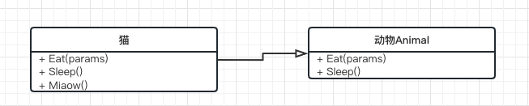
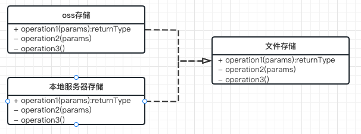
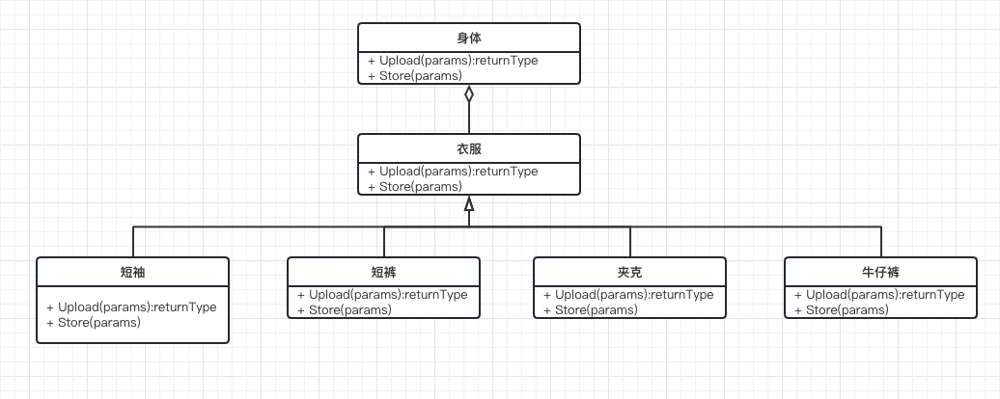
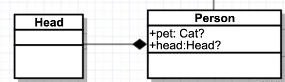
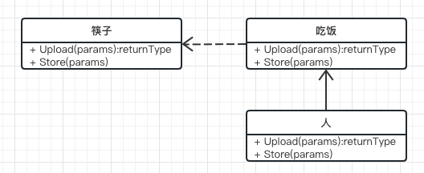

>  uml类图是非常实用的描述代码类之间的关系的图形，流程图可以描述出程序的运行逻辑，而代码设计/类关系就需要用uml类图进行表示

uml类图中有以下六种关系, 本文也会掌握这几种关系，也就不难画出/看懂uml类图了

- 继承/泛化关系
- 实现关系
- 依赖关系
- 关联关系
- 聚合关系
- 组合关系

### 继承/泛化关系

- 就是extend关系  用空心箭头表示
- 
- (猫继承了动物的吃、睡，额外还能喵喵叫)

### 实现关系

- 实现interface接口/abstract抽象类型, 用空心箭头虚线表示

```go
// 接口StoreFile
type StoreFile interface{
  func Upload()
  func Store()
}
// Car实现Vehicle
type OssStoreFile struct{}
func (OssStoreFile)Upload(){}
func (OssStoreFile)Store(){}

type ServerStoreFile struct{}
func (ServerStoreFile)Upload(){}
func (ServerStoreFile)Store(){}
```

- 

### 聚合关系

- 多种属性/方法聚合到一起产生的一种形态/类,  但他们之间是可分离， 这些属性不受限于聚合于某一个形态， 如员工&公司,某件衣服&身体
- 聚合关系用实现空菱形块表示  ---◇ 

            

> 衣服由多种类型的具体衣服实现， 多种衣服穿(聚合)到身上，但也可以分离，今天穿短袖，明天穿夹克，不属于强聚合, 不影响身体(主体)

### 组合关系

- 也是一种聚合关系，但聚合性比聚合关系更强，强调组合之间不可分离， 如脑袋&身体
- 组合关系用实现实菱形块表示



### 依赖关系

- 执行A方法的参数，依赖B类/B类中的某个方法,强调仅在某个时刻依赖某个工具/属性(如你吃饭的时候需要筷子， 筷子则就是你吃饭时的依赖)
- 用虚线箭头表示依赖关系---->



> 人必须(强依赖，又称关联)吃饭，而吃饭时则依赖(不是很强的依赖，也可以依赖叉子)筷子

### 关联关系

- 体现两个类之间的强依赖的关系，具有长期性，比如类A中，一直包含或者关联着类B，这种关联/依赖是较强的，只要使用到A那么B也将会包含, 如 资金&战争, 俗话说枪炮一响，黄金万两，也强调了两者的关联关系
- 用实现箭头表示关联关系 ->


> 技术能力有限，文章中肯定存在疏漏部分，或者产生疑问的地方，欢迎反馈🍵
> https://github.com/wuye251/my-patterns/issues

- 参考
  - [UML类图详解](https://juejin.cn/post/6844903893327937550#heading-4)