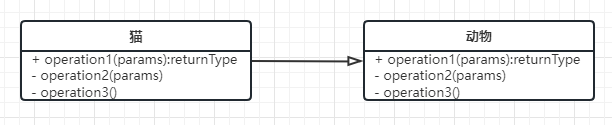
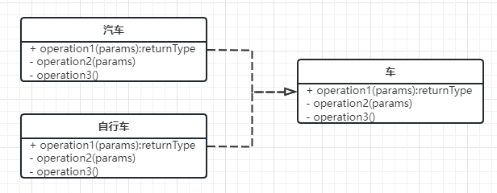
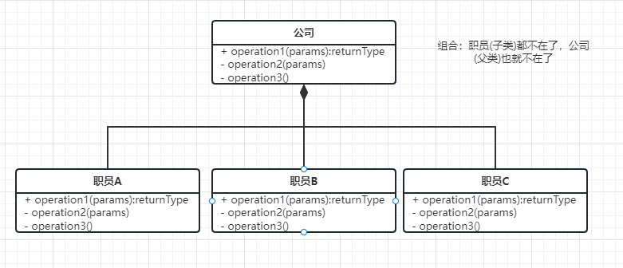

### 继承/泛化关系

- 就是extend关系  用空心箭头表示
- 

### 实现关系

- 实现interface接口/abstract抽象类型, 用空心箭头虚线表示

```go
// 接口Vehicle
type Vehicle interface{
  func func1()
  func func2()
}
// Car实现Vehicle
type Car struct{}
func (Car)func1(){}
func (Car)func2(){}

type Bicycle struct{}
func (Bicycle)func1(){}
func (Bicycle)func2(){}
```

- 

### 组合关系

- c is a + b

```go
```


- 

### 聚合关系

- c = a or b(其中一个没了但是还是c)
- 

### 依赖关系

- 执行A方法的参数，依赖B类/B类中的某个方法(如你吃饭的时候需要筷子， 筷子则就是你的依赖)
- 用虚线箭头表示依赖关系---->

```go

```


### 关联关系

- 体现两个类之间的强依赖的关系，具有长期性，比如类A中，一直包含或者关联着类B，这种关联/依赖是较强的，只要使用到A那么B也将会包含
- 用实现箭头表示关联关系 ->

```go
type A struct {
  B
  varA1
}
type B struct {
   varB1
}
```


- 参考
  - [UML类图详解](https://juejin.cn/post/6844903893327937550#heading-4)