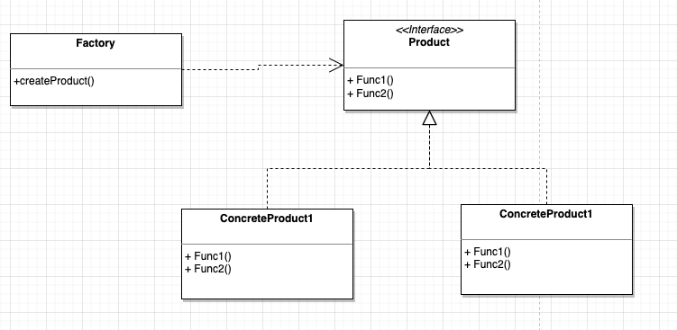

> 将 `业务逻辑->基础方法`的依赖关系, 拆分为 `业务逻辑->实例创建->基础方法`,  后面添加实例(基础方法)类型时,不需要修改业务逻辑，符合单一职责

## 为什么需要简单工厂

举个例子来说, 如果我们要接入阿里oss,并且预计后续会有私有部署时使用的[minio](https://github.com/minio/minio)(本地搭建的oss服务)或者其他厂商的oss服务\

这里我们先写第一版接入阿里oss

```go
package main

import (
	"fmt"
	"io"
)

type AliOSS struct {
	SecretId  string
	SecretKey string
	Bucket    string
}

// UploadFile 上传文件到阿里oss
func (AliOSS) UploadFile(localFilePath, objectKey string) error {
	fmt.Println("alioss upload file")
	return nil
}

// GetFile 下载/获取阿里oss文件
func (AliOSS) GetFile(objectKey string) (io.Reader, error) {
	fmt.Println("alioss get file")
	return nil, nil
}

// GetSignUrl 获取阿里oss临时访问地址
func (AliOSS) GetSignUrl(objectKey string) (string, error) {
	fmt.Println("alioss get sign url")
	return "", nil
}

func main() {
	// 创建逻辑
	alioss := AliOSS{
		SecretId:  "alioss_secret_id",
		SecretKey: "alioss_secret_key",
		Bucket:    "alioss_env_buckect_name",
	}

	// 业务逻辑
	alioss.UploadFile("/tmp/test.txt", "tmp/test.txt")
	alioss.GetFile("tmp/test.txt")
	alioss.GetSignUrl("tmp/test.txt")
}

```

我们第一版上线啦, 这样看上去还是很nice的

····· 时间流逝, 一个月过去了, 半年过去了

产品:"有个私有定制的项目,需要部署到客户内部机器中, 数据不能存到外面, 所以相关地方需要支持本地存储"

这时发现了oss使用的阿里oss,这需要修改成本地的, 于是开始调研哪些成熟的oss库支持本地搭建存储, 偶然间你突然发现了minio的存在, 可以本地搭建，速度也不赖, 该有的功能也全都支持, 这不正合需求嘛, 在你熟悉了提供的官方文档之后,果断撸起袖子加油干, 争取早日上线给客户使用

······ 时光荏苒, 一个月过去了, 私有部署的所有相关修改完成了, 关于你的oss代码成了这样:

```go
package main

import (
	"fmt"
	"io"
	"math/rand"
)

type AliOSS struct {
	EndPoint  string // 服务地址
	SecretId  string // 秘钥id
	SecretKey string // 秘钥key
	Bucket    string // 桶
}

// UploadFile 上传文件到阿里oss
func (AliOSS) UploadFile(localFilePath, objectKey string) error {
	fmt.Println("alioss upload file")
	return nil
}

// GetFile 下载/获取阿里oss文件
func (AliOSS) GetFile(objectKey string) (io.Reader, error) {
	fmt.Println("alioss get file")
	return nil, nil
}

// GetSignUrl 获取阿里oss临时访问地址
func (AliOSS) GetSignUrl(objectKey string) (string, error) {
	fmt.Println("alioss get sign url")
	return "", nil
}

type Minio struct {
	EndPoint string // 服务地址
	User     string // 用户
	Password string // 密码
	Bucket   string // 桶
}

// UploadFile 上传文件到minio
func (Minio) UploadFile(localFilePath, objectKey string) error {
	fmt.Println("minio upload file")
	return nil
}

// GetFile 下载/获取minio文件
func (Minio) GetFile(objectKey string) (io.Reader, error) {
	fmt.Println("minio get file")
	return nil, nil
}

// GetSignUrl 获取minio临时访问地址
func (Minio) GetSignUrl(objectKey string) (string, error) {
	fmt.Println("minio get sign url")
	return "", nil
}

func main() {
	// 获取配置文件判断是否私有部署
	isPrivate := rand.Intn(2)
	if isPrivate == 1 {
		minio := Minio{
			EndPoint: "minio_endpoint",
			User:     "minio_user",
			Password: "minio_password",
			Bucket:   "minio_env_bucket",
		}
		// 业务逻辑
		minio.UploadFile("/tmp/test.txt", "tmp/test.txt")
		minio.GetFile("tmp/test.txt")
		minio.GetSignUrl("tmp/test.txt")
	} else {
		alioss := AliOSS{
			EndPoint:  "alioss_endpoint",
			SecretId:  "alioss_secret_id",
			SecretKey: "alioss_secret_key",
			Bucket:    "alioss_env_buckect_name",
		}
		// 业务逻辑
		alioss.UploadFile("/tmp/test.txt", "tmp/test.txt")
		alioss.GetFile("tmp/test.txt")
		alioss.GetSignUrl("tmp/test.txt")
	}
}

```

这时就没有上次那么nice了,  main方法大了很多, 包含了根据是否私有化走不同oss逻辑, 既包含了创建的内容，也包含了业务逻辑的内容, 这还只是第二版,如果后期再迭代,那么main方法中的代码和逻辑会更庞杂，该如何优化呢?

- 将两个分支逻辑拆开封装成一个方法
  但是会有两个问题
  - 创建和业务逻辑还是耦合的
  - 具有重复的业务逻辑代码

那如何解决上面两个问题呢? 将创建和业务逻辑拆分,解耦合,   还有减少重复的业务逻辑代码

- 增加一个代理方法，里面根据不同if/else条件, 返回不同的实例类，然后根据接口提供的方法进行业务逻辑的实现, **降低了创建和业务逻辑的耦合性**
- 声明一个oss接口，指定有哪些功能方法，main方法中使用实现接口的实例类方法, 这样可以**减少业务逻辑代码**

  秘籍来了, 请用心感受下面代码对于上面两个问题的处理思想

```go
package main

import (
	"fmt"
	"io"
	"math/rand"
)

// oss 接口指定实现类需要提供哪些能力
type OSS interface {
	UploadFile(localFilePath, objectKey string) error
	GetFile(objectKey string) (io.Reader, error)
	GetSignUrl(objectKey string) (string, error)
}

type AliOSS struct {
	EndPoint  string // 服务地址
	SecretId  string // 秘钥id
	SecretKey string // 秘钥key
	Bucket    string // 桶
}

// UploadFile 上传文件到阿里oss
func (AliOSS) UploadFile(localFilePath, objectKey string) error {
	fmt.Println("alioss upload file")
	return nil
}

// GetFile 下载/获取阿里oss文件
func (AliOSS) GetFile(objectKey string) (io.Reader, error) {
	fmt.Println("alioss get file")
	return nil, nil
}

// GetSignUrl 获取阿里oss临时访问地址
func (AliOSS) GetSignUrl(objectKey string) (string, error) {
	fmt.Println("alioss get sign url")
	return "", nil
}

type Minio struct {
	EndPoint string // 服务地址
	User     string // 用户
	Password string // 密码
	Bucket   string // 桶
}

// UploadFile 上传文件到minio
func (Minio) UploadFile(localFilePath, objectKey string) error {
	fmt.Println("minio upload file")
	return nil
}

// GetFile 下载/获取minio文件
func (Minio) GetFile(objectKey string) (io.Reader, error) {
	fmt.Println("minio get file")
	return nil, nil
}

// GetSignUrl 获取minio临时访问地址
func (Minio) GetSignUrl(objectKey string) (string, error) {
	fmt.Println("minio get sign url")
	return "", nil
}

// 生成实例的代理工厂
type Factory struct{}

// 生成实例的不同判断逻辑
func (f Factory) CreateOSS() OSS {
	// 获取配置文件判断是否私有部署
	isPrivate := rand.Intn(2)
	switch isPrivate {
	case 1:
		return f.createMinio()
	default:
		return f.createAliOSS()
	}
}

// createMinio 生成minio的实例
func (Factory) createMinio() *Minio {
	// (省略)获取配置文件中minio的相关配置
	return &Minio{
		EndPoint: "minio_endpoint",
		User:     "minio_user",
		Password: "minio_password",
		Bucket:   "minio_env_bucket",
	}
}

// createAliOSS 生成alioss的实例
func (Factory) createAliOSS() *AliOSS {
	return &AliOSS{
		EndPoint:  "alioss_endpoint",
		SecretId:  "alioss_secret_id",
		SecretKey: "alioss_secret_key",
		Bucket:    "alioss_env_buckect_name",
	}
}

func main() {
	// 创建实例
	oss := Factory{}.CreateOSS()
	// 业务逻辑
	oss.UploadFile("/tmp/test.txt", "tmp/test.txt")
	oss.GetFile("tmp/test.txt")
	oss.GetSignUrl("tmp/test.txt")
}


```

如果后期如果再加其他oss, 我们只需要实现oss的接口方法, 并且添加到创建代理工厂中，而不影响业务逻辑中的代码了,是不是很nice呢!

## 简单工厂的思想

这便是简单工厂模式的思想

- 提供一个工厂(代理)，完成创建工作,   减少创建和业务逻辑代码的耦合性
- 通过接口定义, 业务逻辑面相接口实现功能逻辑, 增加其他类型不影响业务代码， 只需要实现接口的方法以及注册到工厂中即可

因为在上面已经详细推导过过程，不再叙述工厂模式了, 只要记得  `接口+工厂(代理工厂)解耦创建和业务逻辑`就行, 提供一个类图:



## 什么时候用

例子围绕oss一个具体场景来使用简单工厂,  在日常工作中遇到的肯定是五花八门的,  提供一个技巧，什么时候需要考虑用简单工厂

    简单工厂属于**创建型**, 围绕创建解决问题, 故而重点应该放在创建上, 如果有相同功能的不同类型(minio、alioss都是oss上传下载)场景下, 可以将创建这个功能(逻辑) 改成一个简单工厂， 后面的业务逻辑不依赖不同实例产生不同分支

## 优缺点

### 优点

- 符合单一职责, 业务逻辑和创建功能拆分
- 面向接口,  业务逻辑针对oss的接口进行逻辑处理, 这样再添加类型的时候不影响业务逻辑

### 缺点

- 违反开闭原则, 增加一个类型，需要修改工厂内容
- 随着类型增加，工厂越来越庞大，类型实例也会增加,  增加代码复杂度
