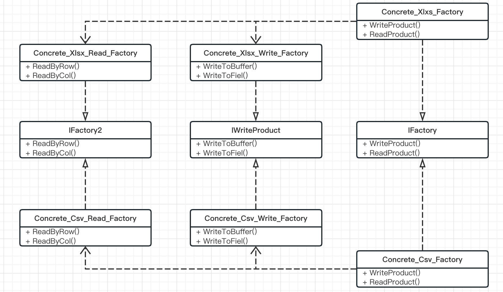

> 工厂模式的基础上，将多个产品的公共逻辑再封装成一个工厂，这样每个产品 由多个工厂进行组成实现一个抽象工厂

将多个具有共性的产品拆分，比如导出功能，有Csv/Xlsx格式(具体产品), 但每个导出的格式都需要有Read/Write方法，并且Read可以按行读/按列读，Write可以写到Buffer中 也可以直接存到本地， 不管Csv/Xlsx都有这几种类型，那么我们可以在导出的工厂基础上，再定义Write/Read的工厂，让每个导出可以完成不同的读写需求， 这样类比与工厂模式，更细粒度的进行构成工厂，那么他们之间的耦合性更低，更符合单一职责、开闭原则
