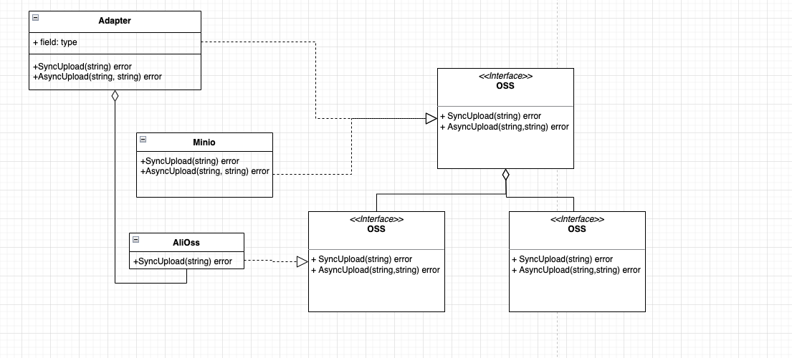

> **适配器模式:** 将一个类的接口转换成客户希望的另外一个接口。使得原本由于接口不兼容而不能一起工作的那些类可以一起工作。

## 角色

适配器模式的三个角色

- **目标接口**（Target）：客户端所期待的接口。目标可以是具体的或抽象的类，也可以是接口。

- **需要适配的类**（Adaptee）：需要适配的类或适配者类。

- **适配器**（Adapter）：通过包装一个需要适配的对象，把原接口转换成目标接口。

## 例子

现在需要提供一个oss接口， 满足同步和异步上传,  你手中现在有阿里oss和minio oss, 其中minio oss支持同步和异步, 但是阿里oss只有同步的接口, 如果想要他们都符合oss接口定义, 则有以下两种选择:

1. 阿里oss中实现一个异步的接口, 这样就都符合/继承oss的抽象定义同步和异步功能
2. 使用适配器, 不修改阿里oss原有内容，新增一个适配器, 实现阿里oss的异步功能

首先第一种,将阿里oss的接口和业务功能耦合在了一块，后续需要修改则影响很大,  加适配器之后将这种耦合拆分，阿里oss类只写关于第三方接口的功能，复用性更高，职责更单一

代码如下:

```go
package main

import (
	"fmt"
	"time"
)

// oss抽象类定义 同步/异步
type OSS interface {
	AsyncOSS
	SyncOSS
}

type SyncOSS interface {
	SyncUpload(filepath string) error
}
type AsyncOSS interface {
	AsyncUpload(filepath, callbackUrl string) error
}

// 关于minio的接口
type Minio struct{}

func (m Minio) SyncUpload(filepath string) error {
	fmt.Println("minio sync upload")
	return nil
}

func (m Minio) AsyncUpload(filepath, callbackUrl string) error {
	fmt.Printf("minio async upload, callback url is %s\n", callbackUrl)
	return nil
}

// 阿里只有同步上传
type AliOSS struct{}

func (a AliOSS) SyncUpload(filepath string) error {
	fmt.Println("ali sync upload")
	return nil
}

// oss同步适配异步的适配器
type OSSAdapter struct {
	oss SyncOSS
}

// 同步还是走原先的oss接口
func (o *OSSAdapter) SyncUpload(filepath string) error {
	o.oss.SyncUpload(filepath)
	return nil
}

// 异步需要通过同步进行实现适配
func (o OSSAdapter) AsyncUpload(filepath, callbackUrl string) error {
	if err := o.oss.SyncUpload(filepath); err != nil {
		return err
	}
	go o.asyncUpload(filepath, callbackUrl)
	return nil
}

func (o OSSAdapter) asyncUpload(filepath, callback string) error {
	// 另启动一个协程进行pull
	// 拿到结果后调用callback
	for {
		fmt.Println("async adapter run")
		time.Sleep(2 * time.Second)
	}
}

func main() {
	var oss OSS
	oss = &Minio{}

	oss.SyncUpload("tmp.txt")
	oss.AsyncUpload("tmp.txt", "callbackurl")

	// 阿里适配
	ali := &AliOSS{}
	oss = &OSSAdapter{ali}
	oss.SyncUpload("tmp.txt")
	oss.AsyncUpload("tmp.txt", "callbackurl")

	// output:
	// minio sync upload
	// minio async upload, callback url is callbackurl
	// ali sync upload
	// ali sync upload
}
```

## UML



## 优点

1.可以让任何两个没有关联的类一起运行。

2.提高了类的复用。

3.增加了类的透明度。

4.灵活性好。

## 缺点

1.过多地使用适配器，会让系统非常零乱，不易整体进行把握。

## 适用场景

1.系统需要使用现有的类，而这些类的接口不符合系统的需要。

2.想要建立一个可以重复使用的类，用于与一些彼此之间没有太大关联的一些类一起工作。

## 附录

- [《B站刘丹冰 --- 适配器模式》](https://www.bilibili.com/video/BV19t4y1w7Tu/?spm_id_from=333.788&vd_source=f53bb49fb78a32947a9360dd16a1cf58)
