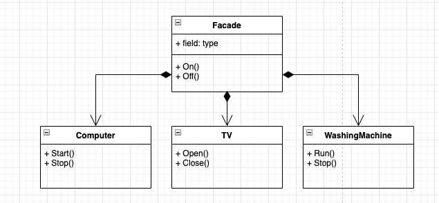

# 概念

外观模式就是解决多个复杂接口带来的使用困难，起到简化用户操作的作用,  在复杂的/繁多的类操作上封装一个类进行组合, 组合成不同的展现形式供客户端使用, 客户端不需要关系里面是如何构成和运行的。(这里也可以用“迪米特法则”来描述:**一个类对于其他类知道的越少越好，就是说一个对象应当对其他对象有尽可能少的了解,只和朋友通信，不和陌生人说话**。)

> 例子：电脑开机，只需要按一下电源键，而不需要去按CPU、内存、硬盘等启动

# 场景分析

## 场景一

取自《大话设计模式》

- 股民买股票和买基金的道理,  如果直接买股票，各种各样的股票选择，每个股票你需要了解他的市场情况, 对于新入手的股民很大概率成为“韭菜”， 就类比有很多的类需要操作，代码复杂度高
- 基金经理出现了，他根据市场的股票组合了多种不同的形式面向股民，股民在购买这些基金时相比于股票的理财难度大大降低(将鸡蛋放在不同的篮子里风险肯定会小一些)，因为基金经理的经验肯定比普通股民更丰富些，更了解市场， 所以通过基金经理售出的基金，股民不需要全部了解其中的股票，这样股民和股票之间的耦合度就大大降低了，上手难度也小了很多。

所谓

- 股票(各种各样的类)
- 基金经理(基金) 将股票进行不同组合，提供较少的选择(外观层，对于客户端更清晰，耦合性更低，迪米特法则)
- 股民(客户端)  选择更少更清晰，不需要太多了解内部实现原理

这样便是一个"外观模式"

## 场景二

家庭物联网

- 在你下班到家得时候, 一进门有一个**按钮**: 打开灯光，打开电脑，开始洗衣服，开始烧热水

- 去上班的时候，按个**按钮**：关闭灯光，关闭电脑，关闭热水器...

是不是也很符合“外观模式"

- 按钮是封装的外观类, 对于你只展现一个按钮， 不需要关心这个按钮按下去之后，电脑、灯光什么的关闭，把他们封装到这个按钮的底层
- 以后你也不必再每次上班时 关灯、关电脑、关热水器这些流程都来一次

### 代码示例

```go
package main

type Computer struct{}

func (cg *Computer) Start() {
	println("Computer start")
}

func (cg *Computer) Stop() {
	println("Computer stop")
}

type TV struct{}

func (tv *TV) Open() {
	println("TV open")
}

func (tv *TV) Close() {
	println("TV close")
}

type WashingMachine struct{}

func (wm *WashingMachine) Run() {
	println("WashingMachine run")
}

func (wm *WashingMachine) Stop() {
	println("WashingMachine stop")
}

type Facade struct {
	cg *Computer
	tv *TV
	wm *WashingMachine
}

// 对外的接口打开一套设备
func (f *Facade) Play() {
	f.cg.Start()
	f.tv.Open()
	f.wm.Run()
}

// 对外的接口关闭一套设备
func (f *Facade) Stop() {
	f.cg.Stop()
	f.tv.Close()
	f.wm.Stop()
}

func main() {
	f := Facade{&Computer{}, &TV{}, &WashingMachine{}}
	f.Play()
	f.Stop()
}

```

### UML



# 优缺点

**优点**

1. 子系统和用户之间松耦合，通过外观类即可实现一套流程实现
2. 提高安全性, 用户不知道内部如何组装运行，了解的东西更少

**缺点**

1. 不符合开闭原则, 增加一个子系统, 需要在外观中也需要修改
2. 组合过多，代码量也会提升

# 适用场景

1. 当你要为一个复杂子系统提供一个简单接口时。

2. 客户程序与多个子系统之间存在很大的依赖性。

3. 构建一个层次结构的子系统时，使用外观模式定义子系统中每层的入口点可以简化子系统的依赖关系。

4. 当你需要构建一个层次结构的子系统时，使用外观模式定义子系统中每层的入口点可以简化子系统的依赖关系。

