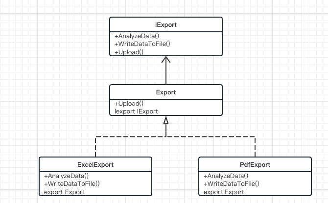

> 多个类之间具有相同功能的方法，部分方法逻辑完全相同，部分方法逻辑不同， 那么可以提供一个抽象方法声明他们所有的方法，  一个基类实现部分逻辑完全相同的方法，  部分逻辑不相同的方法分别在各自类中独自实现

UML图如下：

IExport为 导出的所有需要方法的抽象类,  Export相当于模板类，实现了逻辑完全相同的方法，具体的ExcelExport和PdfExport产品类继承了模板的公共方法并且将抽象方法进行了实现